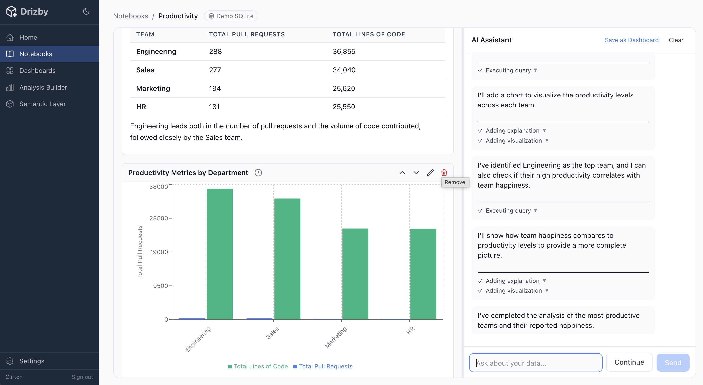

# Drizby

**[www.drizby.com](https://www.drizby.com)**



**Open-source BI platform powered by [drizzle-cube](https://try.drizzle-cube.dev).** Self-service analytics, AI agentic notebooks, and a full semantic layer — in one deployable app.

Drizby is a Metabase-style analytics platform that uses your existing Drizzle schemas to power dashboards, notebooks, and ad-hoc analysis. Define your metrics once in the semantic layer, then access them everywhere — dashboards, APIs, or AI agents — with consistent definitions and built-in multi-tenant security.

> **Work in progress.** Drizby is under active development.

## Quick Start

One command:

```bash
docker run -p 3461:3461 -v drizby-data:/app/data ghcr.io/cliftonc/drizby:main
```

Open [http://localhost:3461](http://localhost:3461) and follow the setup wizard to create your admin account. A demo dataset with sample employee/productivity data is seeded automatically on first run.

The `-v drizby-data:/app/data` flag persists your databases and configuration across container restarts. To start fresh, run `docker volume rm drizby-data`.

## Features

### Semantic Layer (drizzle-cube)

At the core of Drizby is [drizzle-cube](https://drizzle.cube) — a semantic layer that compiles your Drizzle ORM schemas into analytics cubes. Define business metrics (measures, dimensions, joins) once, and every part of the platform queries through it with consistent definitions and row-level security.

- **Use your existing Drizzle schema** — if you already have Drizzle ORM, you're 80% done
- **Database introspection** — auto-generate schemas from existing databases with `drizzle-kit pull`
- **AI-powered cube generation** — point AI at your schemas and it generates cube definitions for you
- **Multi-tenant security** — organisation-based row-level isolation enforced at the query layer
- **PostgreSQL and SQLite** support

### Dashboards

Drag-and-drop grid dashboards with rich visualizations:

- **Chart types:** bar, line, area, pie, scatter, KPI cards, and data tables
- **Grid layout** with resizable, draggable portlets (react-grid-layout)
- **Per-dashboard filtering** and configuration
- **Save, load, and reset** dashboard configurations
- **Thumbnail generation** for dashboard listings

### Agentic AI Notebooks

Conversational AI-powered data exploration:

- **Multi-turn AI conversations** — ask questions about your data in natural language
- **Mixed content blocks** — markdown, charts, and query results in one document
- **Auto-save** — notebook state persists automatically
- **Dashboard creation** — promote notebook blocks into full dashboards
- **Configurable AI provider** — Anthropic Claude, OpenAI, or Google Gemini

### Analysis Builder

Visual, no-code query builder:

- Select connections, measures, dimensions, and filters
- Real-time results as you build queries
- No SQL or code required

### Schema & Cube Editor

Full IDE experience for defining your semantic layer:

- **Monaco editor** with TypeScript autocomplete for Drizzle ORM and drizzle-cube types
- **Real-time compilation** with inline error reporting
- **Schema files** — write Drizzle table definitions, compile and validate
- **Cube definitions** — define measures, dimensions, and joins, then register with the semantic layer
- **AI cube generation** — stream-powered SSE endpoint that generates cubes from your schemas

### Connections

Multi-database connection management:

- **PostgreSQL and SQLite** support
- Connection string management and testing
- Per-connection schema and cube compilation
- Each connection gets its own isolated semantic layer instance

### Team & Auth

- Email/password authentication
- Google OAuth
- Role-based access control (admin, member, pending user)
- User registration with admin approval
- Session-based auth with secure cookies

### AI Settings

- Configure your AI provider (Anthropic, OpenAI, Google Gemini)
- Set API keys, model selection, and custom base URLs
- Powers both agentic notebooks and AI cube generation

---

### Build from source

```bash
git clone https://github.com/cliftonc/drizby.git && cd drizby && docker build -t drizby . && docker run -p 3461:3461 -v drizby-data:/app/data drizby
```

### From Source (development)

```bash
git clone https://github.com/cliftonc/drizby.git
cd drizby
npm install --legacy-peer-deps
npm run setup    # Generate migrations, run them, seed demo data
npm run dev      # Start dev server on http://localhost:3460
```

---

## How It Works

1. **Connect a database** — add a PostgreSQL or SQLite connection string
2. **Define your schema** — write Drizzle table definitions or introspect from your database
3. **Create cubes** — define analytics metrics and dimensions (or let AI generate them)
4. **Build dashboards** — drag-and-drop charts powered by your semantic layer
5. **Explore with AI** — open an agentic notebook and ask questions in natural language

---

## Tech Stack

| Layer | Technology |
|-------|-----------|
| Semantic Layer | [drizzle-cube](https://drizzle.cube) |
| Backend | Hono, TypeScript, Drizzle ORM |
| Frontend | React 18, TanStack Query, Recharts, Tailwind CSS |
| Code Editor | Monaco Editor |
| Dashboard Grid | react-grid-layout |
| Internal DB | SQLite (better-sqlite3) |
| User Databases | PostgreSQL, SQLite |
| AI Providers | Anthropic Claude, OpenAI, Google Gemini |
| Auth | Sessions, Google OAuth (Arctic), CASL permissions |

---

## License

MIT
